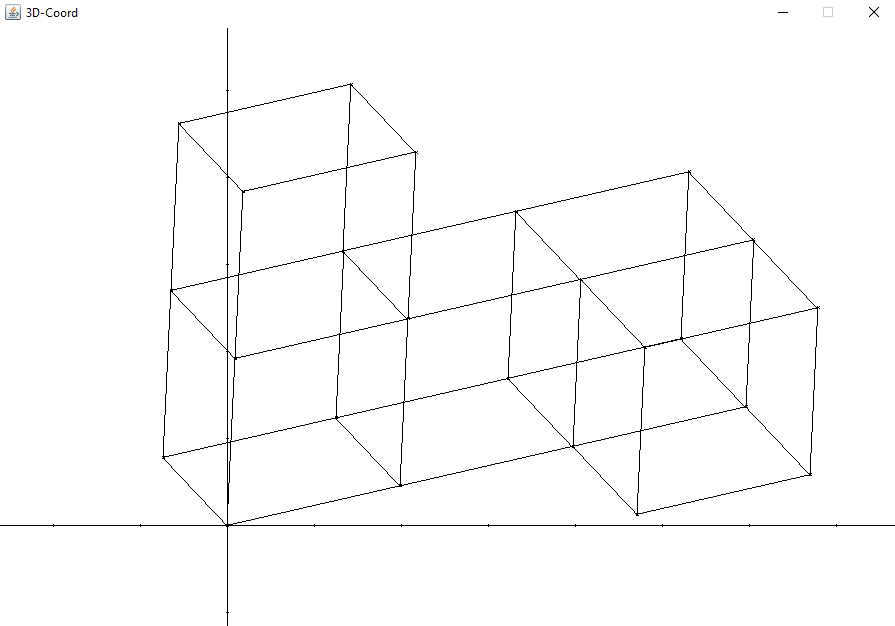
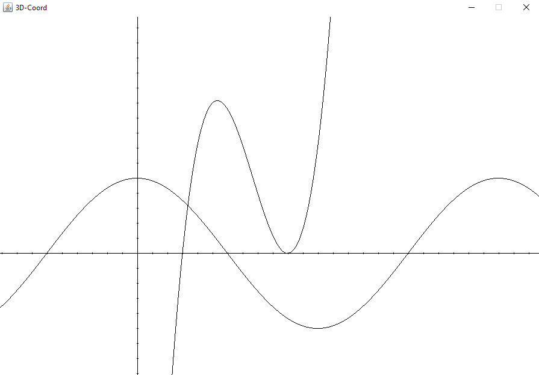

# Coord-3D
This project includes a simple graphical 3D coordinate system written in Java.
Currently cubes and 2D function graphs can be represented.

The rendering engine is build from scratch and derived from this tutorial series: [The Cherno - Game Programming](https://www.youtube.com/playlist?list=PLlrATfBNZ98eOOCk2fOFg7Qg5yoQfFAdf)

## Cubes

## Function graphs

